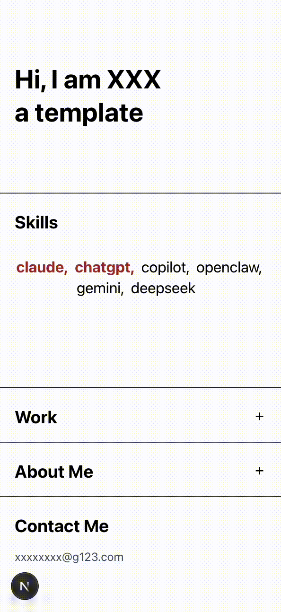

# Portal - Portfolio

Hi! This is a bento-style portfolio page designed by me and developed collaboratively with AI. Feel free to clone this repository to use, customize, or even improve it for your own projects.

Sanity CMS is integrated (mainly because I wanted to explore working with a CMS), but it’s completely optional.Content can be served either from Sanity or from a local static file (data/content.ts), controlled by a single environment variable. You can run and deploy the site without configuring Sanity. Please check the setup instructions below — they were generated with AI assistance, but they’re clear and tested step by step.

## Demo

[live demo](https://bento-portofolio-template.vercel.app/)

### Laptop


### Mobile



## Getting Started

```bash
npm install
npm run dev
```

Open [http://localhost:3000](http://localhost:3000) to view the site.

## Sanity CMS

### Project Structure

```
sanity/
  schemaTypes/       # Document schemas (hero, skills, about, siteContact, projectCategory)
  lib/
    client.ts        # Sanity client
    queries.ts       # GROQ queries
    image.ts         # Image URL builder
  env.ts             # Environment variable helpers
  structure.ts       # Studio sidebar structure (singletons + lists)
data/
  types.ts           # Shared TypeScript types used by both local data and Sanity
  content.ts         # Local fallback data
lib/
  data.ts            # Unified data layer (reads USE_SANITY flag)
```

### Configure Environment

Copy the example file:

```bash
cp .env.example .env.local
```

**Sanity is optional.** You can deploy without any Sanity configuration — the site will use local data from `data/content.ts` by default.

To enable Sanity CMS, add your project credentials to `.env.local`:

```env
NEXT_PUBLIC_SANITY_PROJECT_ID="your-project-id"
NEXT_PUBLIC_SANITY_DATASET="production"
NEXT_PUBLIC_USE_SANITY="true"
```

### Run Sanity Studio Locally

Sanity Studio is embedded in the Next.js app at the `/studio` route. No separate process is needed.

1. Ensure your Sanity credentials are set in `.env.local`
2. Start the dev server: `npm run dev`
3. Open [http://localhost:3000/studio](http://localhost:3000/studio)
4. Log in with your Sanity account
5. Add content for each section: Hero, Skills, About, Contact, and Project Categories

> **Note:** If Sanity is not configured, visiting `/studio` will show a configuration message instead.

### Connect Sanity to the Site

The data layer (`lib/data.ts`) handles this automatically. When `NEXT_PUBLIC_USE_SANITY` is `"true"`, it fetches from Sanity via GROQ queries. When `"false"`, it returns the static data from `data/content.ts`.

The page is a server component that calls `getSiteData()` at render time, so switching data sources requires no component changes.

### Toggle Between Sanity and Local Data

In `.env.local`, set the flag:

```env
# Use Sanity CMS as the data source
NEXT_PUBLIC_USE_SANITY="true"

# Use local data/content.ts instead
NEXT_PUBLIC_USE_SANITY="false"
```

Restart the dev server after changing this value.

When Sanity is enabled but a section is missing data (e.g., the document hasn't been created yet), the site falls back to the corresponding local data for that section.

### Deploy

#### GitHub Pages (personal homepage)

The project is set up to deploy as a **static site** to GitHub Pages without losing style or function:

- **Static export**: `next build` produces an `out/` folder (static HTML, CSS, JS). No Node server is needed.
- **Data**: Content is baked in at build time from `data/content.ts` or from Sanity if enabled. No runtime server required.
- **Assets**: Fonts, Tailwind, and images (including Sanity CDN) are included; images use `unoptimized: true` so they work on static hosting.
- **Studio**: Sanity Studio at `/studio` is a client-side app that talks to Sanity’s API; it works from the static export.

**Steps:**

1. In the repo: **Settings → Pages → Build and deployment**: set **Source** to **GitHub Actions**.
2. Push to `main` (or run the “Deploy to GitHub Pages” workflow manually). The workflow builds the app and deploys the `out/` folder.
3. **Personal site at root** (e.g. `https://username.github.io/`): use a repo named **`username.github.io`**. The workflow detects this and builds with no base path. Put this template's code in that repo and deploy.
4. **Project site** (e.g. `https://username.github.io/bento_portofolio_template/`): use any other repo name; the workflow uses the repo name as base path.

To use **Sanity** on GitHub Pages, add repo **Secrets**: `NEXT_PUBLIC_SANITY_PROJECT_ID`, `NEXT_PUBLIC_SANITY_DATASET`, and in the workflow uncomment and set `NEXT_PUBLIC_USE_SANITY: "true"` and the Sanity env vars. Add your Pages URL (including base path if project site) to [Sanity CORS](https://www.sanity.io/docs/cors) (e.g. `https://username.github.io` or `https://username.github.io/bento_portofolio_template`).

**Which URL shows the portfolio?** For a **personal site** use a repo named `username.github.io` → your site is **`https://username.github.io/`**. For any other repo name the site is **`https://username.github.io/repo-name/`**.

**If you see the README instead of the portfolio:** (1) Use the project URL above, not the repo URL on github.com. (2) Set **Settings → Pages → Source** to **"GitHub Actions"**. (3) Run the "Deploy to GitHub Pages" workflow (push to `main` or run it from the Actions tab) and wait for it to finish.

#### Without Sanity (Simple)

No extra configuration needed. Just deploy the Next.js app:

```bash
npm run build
```

The site will use local data from `data/content.ts`.

#### With Sanity CMS

Sanity Studio ships as part of the Next.js build. No separate deployment step is needed.

1. Set environment variables in your hosting provider (e.g., Vercel):
   - `NEXT_PUBLIC_SANITY_PROJECT_ID`
   - `NEXT_PUBLIC_SANITY_DATASET`
   - `NEXT_PUBLIC_USE_SANITY="true"`
2. Deploy the Next.js app as usual (`npm run build` or via Git integration)
3. The studio will be accessible at `your-domain.com/studio`

To manage CORS origins (required for the studio to communicate with Sanity's API):

```bash
npx sanity cors add https://your-domain.com
```

## Learn More

- [Next.js Documentation](https://nextjs.org/docs)
- [Sanity Documentation](https://www.sanity.io/docs)
- [GROQ Query Language](https://www.sanity.io/docs/groq)
